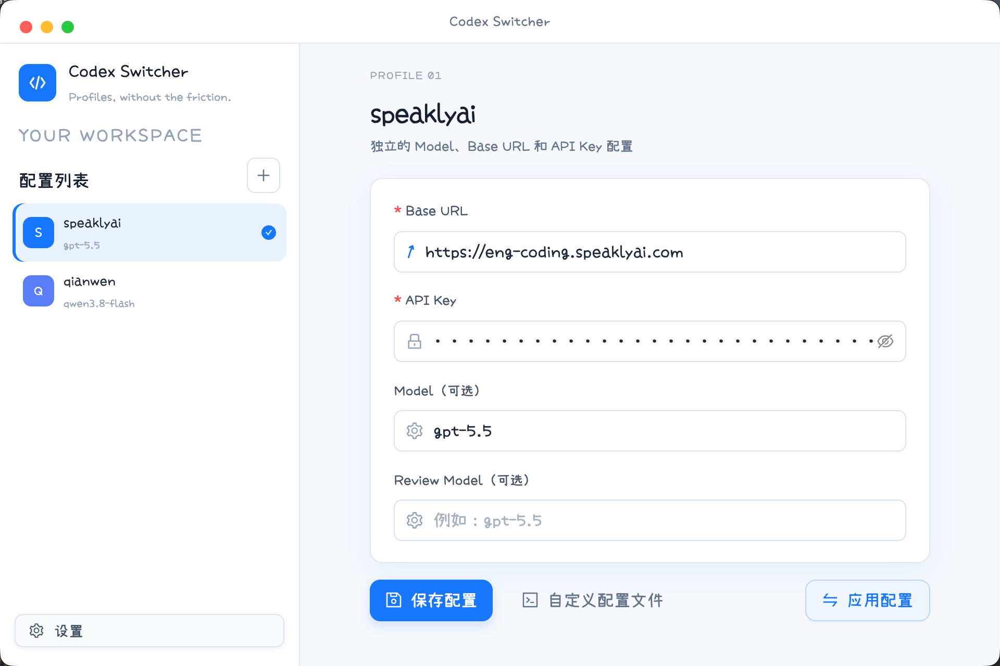

# Codex Switcher

一个基于 Electron + React + Vite + Ant Design 的 macOS / Windows Codex profile 切换工具。



## 开发环境

需要安装 Node.js 18+ 和 Yarn 1.x。安装依赖：

```bash
yarn install
```

项目使用 `electron-vite` 组织主进程、预加载脚本和 React renderer，并通过项目内 `.yarnrc` 使用 Electron 国内镜像下载 Electron 二进制，减少安装时访问 GitHub 超时的问题。

启动开发模式：

```bash
yarn dev
```

开发模式支持 DevTools 调试，但默认不会自动打开。Windows 下可以直接使用开发窗口内的 DevTools；macOS 下也可以使用独立 DevTools 窗口调试。

开发模式默认不会自动打开控制台，需要调试时使用快捷键：macOS 按 `⌥ Option + ⌘ Command + I`，Windows / Linux 按 `Ctrl + Shift + I`。

## 构建与打包

只构建 renderer、主进程和 preload：

```bash
yarn typecheck
yarn build
```

正式打包只保留以下两个命令：

```bash
# macOS Apple Silicon：生成 DMG 和 ZIP
yarn dist:mac

# Windows x64：生成 NSIS 安装器和 portable 便携版
yarn dist:win
```

打包结果位于 `release/`。建议在目标系统上完成最终打包：

- Windows 使用 PowerShell 或 CMD 执行 `yarn dist:win`。
- macOS Apple Silicon 使用 Terminal 执行 `yarn dist:mac`。
- 在 macOS 上交叉构建 Windows 安装包可能需要 Wine，Windows 原生构建最稳定。
- `yarn dist:win` 只生成 Windows x64 包；在 Apple Silicon macOS 上交叉构建会下载对应的 Windows Electron 运行时。
- macOS 签名、公证和 Windows 代码签名需要额外配置证书，本项目默认生成未签名包。

Windows 安装包支持自定义安装目录，并同时生成开始菜单和桌面快捷方式；portable 版本无需安装即可运行。给别人分发时使用 `release/Codex Switcher-0.1.0-win-x64.exe` 这类 NSIS 安装程序，不要分发 `*-portable.exe` 或 `win-unpacked/` 目录。

## 平台行为

- macOS：图标显示在顶部菜单栏，点击托盘图标展示 profile 列表。
- Windows：图标显示在任务栏右侧通知区域，点击托盘图标展示 profile 列表。
- 点击 profile 会直接应用配置，并通过应用内消息提示成功或失败。
- macOS 和 Windows 关闭主窗口时会隐藏到托盘；需要退出应用时，请使用托盘菜单中的“退出”。
- Windows 使用独立的最小化、最大化/还原和关闭按钮，窗口支持拖动调整大小。
- 主窗口默认宽度和最小宽度为 900px，高度和最小高度为 640px；右侧配置内容会随窗口宽度自适应。

## Codex 配置目录

默认读写 Codex 配置目录：

- macOS / Linux：`~/.codex`
- Windows：`%USERPROFILE%\.codex`

如果 Codex 使用了其它目录，可以在启动前设置 `CODEX_HOME`：

```bash
# macOS / Linux
CODEX_HOME=/path/to/.codex yarn dev

# Windows PowerShell
$env:CODEX_HOME = "$env:USERPROFILE\.codex"
yarn dev

# Windows CMD
set CODEX_HOME=%USERPROFILE%\.codex
yarn dev
```

也可以在应用设置中直接打开当前 Codex 配置目录。

应用通过 `$CODEX_HOME/config.toml` 是否存在判断 Codex 是否已安装。首次安装 Codex 后，请重新启动应用，或在空页面点击“重新检测 Codex”。

## 配置格式

每个配置保存为 `$CODEX_HOME/<profile-name>.config.toml`，例如：

```toml
model = "gpt-5.5"
model_provider = "work"

[model_providers.work]
name = "work"
base_url = "https://api.example.com/v1"
wire_api = "responses"
requires_openai_auth = false
experimental_bearer_token = "sk-example"
```

表单保存会重新序列化 TOML，避免重复 key。点击“应用配置”后，profile 中的 `model`、`review_model`、`model_provider` 和 `model_providers` 会合并写入 `$CODEX_HOME/config.toml`，其它已有顶层配置和 provider 会保留；profile 文件本身继续保留。自定义编辑器允许直接维护完整 TOML，并在保存前做语法校验。
